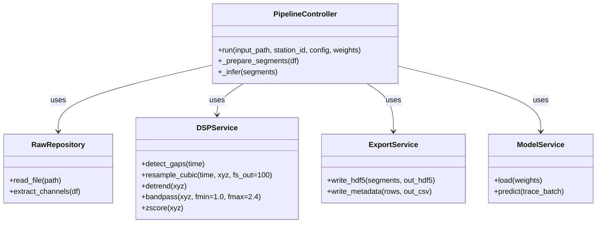
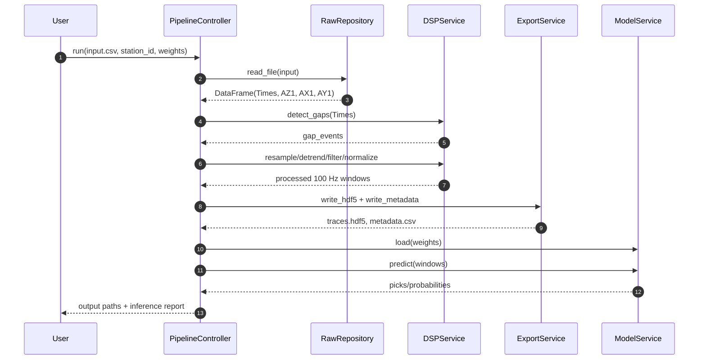

# LFSP Architecture (Controller-Service-Repository)

This document describes a clean separation of concerns for the Low-Frequency Seismic Pipeline (LFSP).

## 1. Architectural intent

LFSP follows a Controller-Service-Repository pattern (MVC/DAO-inspired):

- **Repository layer** isolates data I/O and schema handling.
- **Service layer** contains deterministic signal processing and export logic.
- **Controller layer** coordinates the pipeline and inference lifecycle.

This layout improves testability, maintainability, and portability across data sources.

## 2. Component responsibilities

### `RawRepository` (`src/data_access/raw_repository.py`)
- Reads CSV/Excel inputs.
- Selects required fields: `Times(s)`, `AZ1(m/s2)`, `AX1(m/s2)`, `AY1(m/s2)`.
- Validates missing columns and returns canonical DataFrame format.

### `DSPService` (`src/services/dsp_service.py`)
- Detects data gaps where `Δt > 0.2 s`.
- Applies optional split/pad policy for gaps.
- Resamples 5 Hz data to 100 Hz using cubic spline interpolation (`scipy.interpolate`).
- Detrends and applies 1.0–2.4 Hz bandpass filtering.
- Produces normalized windows for downstream export/inference.

### `ExportService` (`src/services/export_service.py`)
- Converts preprocessed windows into SeisBench-compatible HDF5.
- Stores each trace in `/data/<trace_name>` with shape `(6000, 3)` and dtype `float32`.
- Writes metadata CSV with `trace_name`, `start_time`, and `station_id`.

### `ModelService` (`src/services/model_service.py`)
- Loads SeisBench/EQTransformer detector with `instance` or `ethz` weights.
- Executes inference on exported or in-memory traces.
- Returns model picks/probabilities in a controller-friendly format.

### `PipelineController` (`src/core/pipeline_controller.py`)
- Orchestrates end-to-end workflow:
  1. Load raw source.
  2. Preprocess and segment.
  3. Export artifacts.
  4. Run inference.
  5. Emit summaries/logs.

## 3. Mermaid class diagram

## 4. Mermaid sequence diagram

## 5. Error handling and observability

- Gap detection logs include timestamp and gap duration.
- Repository raises explicit schema errors for missing required columns.
- Controller emits stage-level timing and counts (loaded rows, exported traces, detections).
- Service exceptions remain localized and are wrapped with actionable context.

## 6. Future extensions

- Add `StreamingRepository` for live ingestion.
- Introduce dependency injection for repository/service swap-in.
- Support additional model backends (PhaseNet, custom Torch checkpoints).
- Add `DatabaseExportService` for direct persistence to analytical stores.
